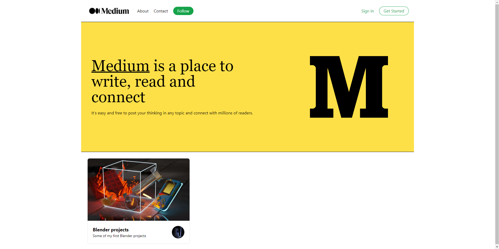

<h1 align="center">Spotify 2.0</h1>

---

---

## Be Welcome!

Thanks for checking out this project!

This project is part of [Sonny Sangha](https://www.youtube.com/channel/UCqeTj_QAnNlmt7FwzNwHZnA) React tutorials.

**Don't forget to set your own environment variables.**

## Links

- Sonny Sangha build live: [Medium 2.0](https://www.youtube.com/watch?v=I2dcpatq54o&t=10100s)
- Live site: [Medium Clone](https://mediumsanityclone.vercel.app/)

## Built with

- [React](https://reactjs.org/) - JS library
- [Next.js](https://nextjs.org/) - React framework
- [Tailwind css](https://tailwindcss.com/) - CSS framework
- [Sanity](https://www.sanity.io/) - CMS
- [React Hook Form](https://react-hook-form.com/) - React Hook Form

## Useful resources

- [ISR](https://vercel.com/docs/concepts/next.js/incremental-static-regeneration) - Next doc about Incremental Static Regeneration
